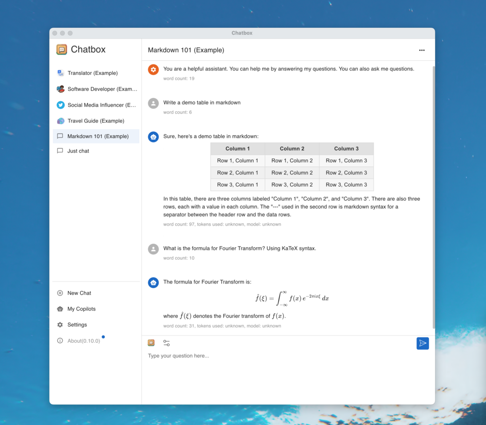
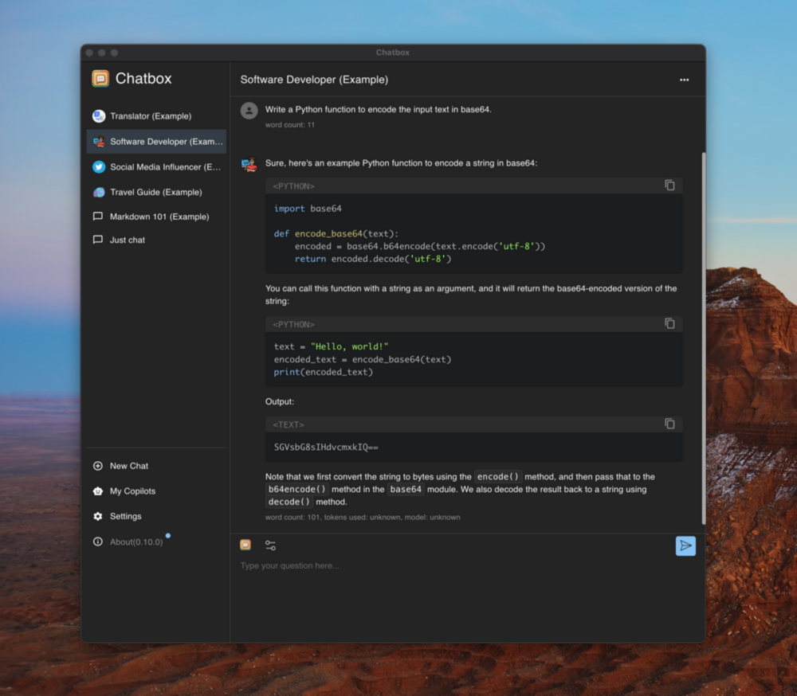

# Chatbox Mod（世界书增强版）

> 基于官方 Chatbox v1.23.5（AGPL-3.0）Fork 的个人自用改造版，新增世界书 / 人物卡 / 小说分章续写 / 自动剧情更新等功能。
> **本文件是项目工作流程与协作规则文档，接手本仓库的 AI（或开发者）请先完整阅读本节，再往下看官方说明。**

---

## 构建与交付纪律（V16 复盘固化 · 接手必读）

> 2026-10-07 V16 增量交付暴露 5 个问题（双构建并发、删运行中产物、密钥用错、native 库被压缩、zip 结构差异）；V17 又暴露 2 个（重打包路径写错 `public/` 而非 `assets/public/` 导致新代码不生效；强制中文逻辑未延续导致界面变英文）；V17.3 再暴露 1 个（**移动端构建未注入 `CHATBOX_BUILD_TARGET=mobile_app`**，产物以 `"unknown"` 平台运行 → WebPlatform 读 localStorage，SQLite 旧数据全部读不到「数据消失」+ 移动端应隐藏的 Keyboard Shortcuts 入口错误显示）。完整复盘见 `docs/technical/build-delivery-playbook.md`。以下为铁律：

0. **构建前必读（强制流程）**：**每次构建/重打包/交付前，必须先完整通读 `docs/technical/build-delivery-playbook.md`**（六查清单、重打包铁律、密钥、参考命令），确认无遗漏后才可执行构建；违反本流程视为流程事故
1. **单进程构建**：后台句柄丢失 ≠ 进程死亡，先 `ps` 查进程再决定；绝不删运行中构建的输出；同一构建绝不启动两次
2. **重打包铁律**：非网页条目从基底 APK **字节级原样复制**（不重写）；`lib/*.so` 与 `assets/dexopt/*` 必须保持 STORED（压缩即真机安装失败）；**网页产物路径是 `assets/public/`**（Android 原生 assets，不是 `public/`）——重打包必须剔除基底的 `assets/public/*` 并把新产物写入 `assets/public/`，交付前验证 APK 内 `assets/public/js/index.*.js` 含新功能特征串
3. **密钥唯一**：只用 `v48-keys/签名密钥/chatbox-mod.keystore`（指纹 aa46319b85），用前 `keytool` 验指纹
4. **移动端构建命令（V17.3 新增铁律）**：交付 Android APK 的 renderer 构建**必须**用 `pnpm run mobile:sync:android`（其内部注入 `CHATBOX_BUILD_TARGET=mobile_app CHATBOX_BUILD_PLATFORM=android`）；**禁止裸 `electron-vite build` / 裸 `npx cross-env ... electron-vite build` 交付移动端**（不注入 target 时产物 `CHATBOX_BUILD_TARGET="unknown"`，运行时走 WebPlatform→localStorage，读不到 SQLite 旧数据=用户数据「消失」，且平台判定错乱导致移动端应隐藏的入口错误显示）
5. **交付前六查**：`unzip -t`（zip 完整）/ `zipalign -c -p 4`（对齐）/ `apksigner verify`（签名）/ `aapt dump badging`（manifest 可解析）/ `.so` 存储方式必须 Stored / **`unzip -p <apk> assets/public/js/index.*.js | grep -c 'CHATBOX_BUILD_TARGET="mobile_app"'` 必须 ≥1**（构建 target 正确注入，防数据层错位）
6. **体积默认压缩**：`CHATBOX_NO_MINIFY` 仅作应急，交付后补压缩版（否则慢网下载易损坏）
7. **界面语言硬约束**：本项目界面**必须简体中文**（用户明确要求，不接受英文/跟随系统）。启动强制 `i18n.changeLanguage('zh-Hans')`，改动涉及语言/设置初始化时不得回退为 `settings.language`

---

## 最近改动（web 端修改）

> 本次为 **Web 端修改版本**，功能已合并至 `main`，push 后由 GitHub Actions 自动构建 APK 并发布 Release。

- **会话装载弹窗**：创作设置上拉板顶部新增「世界书 / 人物卡」**并排标签**，点击切换对应内容。
- **数据导出**：支持自定义导出文件名并选择保存路径（Web 走系统「另存为」，移动端走 SAF）。
- 涉及：`src/renderer/modals/CreativeLoadSheet.tsx`、`src/renderer/modules/ui/ExportModal.tsx`、`src/renderer/modules/export.ts`、`src/renderer/modules/ui/ChatboxModPage.tsx`
- 对应提交：`e608951`（创作设置标签）、`16b2226`（导出功能）

---

## 一、这是什么

| 项 | 值 |
|---|---|
| 基座 | 官方 Chatbox v1.23.5（github.com/chatboxai/chatbox） |
| 包名 | `xyz.chatboxapp.chatbox` |
| 功能 | 世界书、人物卡、小说分章/续写、自动剧情更新、v48 数据迁移、管理界面 |
| 形态 | Capacitor 混合 App（Android APK / web / 桌面） |
| 目标 | **个人自用、长期迭代**，不指望官方出这些功能 |

## 二、代码结构（改动都在哪）

```
src/renderer/modules/          ★ 全部自研功能（TS 源码，可读可改）
├── types.ts                  领域类型（WorldBookEntry / CharacterCard / ModFolder）
├── storage.ts                官方存储键封装
├── store.ts                  数据 CRUD / 备份 / 日志 / 设置（Jotai atoms）
├── prompt.ts                 世界书/人物卡提示词注入（命中规则）
├── session.ts                会话级绑定（settings.worldBookIds / characterCardIds）
├── analyze.ts                长文分析（分块→提取→合并）
├── auto-update.ts            自动剧情更新（响应式订阅，非轮询）
├── novel.ts                  小说分章/续写
├── export.ts                 导出（官方 exporter）
├── migration.ts              v48 localStorage 数据一键迁移（幂等）
├── index.ts                  运行时入口（initChatboxMod）
└── ui/ChatboxModPage.tsx     管理界面（/settings/mod，6 Tab）

官方源码侵入点（仅 3 处，均带 [Chatbox Mod] 注释，勿删）：
1. packages/chatbox-core/src/domain/settings/settings-schema.ts  → SessionSettingsSchema 增加 worldBookIds / characterCardIds（zod .optional().catch(undefined)）
2. src/renderer/stores/session/agent-harness.ts                → instructions 组装链上插入世界书/人物卡注入段（动态 import）
3. src/renderer/index.tsx + routes/settings/route.tsx          → 模块初始化 + 设置页导航项

android/                        Capacitor Android 工程（含 keystore/ 签名密钥）
.github/workflows/build-apk.yml  CI：构建→签名→发布 Release
capacitor.config.ts              appId / webDir 等
electron.vite.config.ts          已调低内存占用（sourcemap/gzipSize 关闭）
```

## 三、开发工作流程（核心规则）

### 3.1 改动范围
- 新增/修改功能：**只改 `src/renderer/modules/`**（自己的一亩三分地）
- 需要接入官方机制（存储/提示词/会话/UI）：改 3 个官方侵入点，**必须保留 `[Chatbox Mod]` 注释**
- **不要**改动官方其他代码，不要重排官方结构

### 3.2 编码规范
- 语言：TypeScript（严格模式），**提交前必须 tsc 通过（0 错误）**
  ```bash
  node --max-old-space-size=8192 ./node_modules/typescript/bin/tsc --noEmit
  ```
- 数据读写一律走官方存储后端（`storage.ts` 封装），**禁止**直接 localStorage（5MB 上限）
- 提示词注入走 `prompt.ts` / `agent-harness.ts` 官方组装链，禁止在 bundle 外打补丁
- 关键逻辑加中文注释，注释占比不低于 15%

### 3.3 提交规范
- commit message 格式：`类型: 中文描述`（类型：feat / fix / refactor / docs / ci / perf）
- 示例：`feat: 世界书支持按关键词命中注入`、`fix: 分章正则匹配第X章失败`
- **每轮改动聚焦 1-3 个相关需求**（验证成本低、出问题好定位），不要一次堆十几个改动
- 提交前检查：`git status` 确认没有误改官方代码、没有误提交敏感文件

### 3.4 发布流程（push 即发布）
```bash
git add -A && git commit -m "feat: ..." && git push origin main
```
push 后 GitHub Actions 自动执行：
1. `pnpm install --frozen-lockfile`
2. 构建 renderer（mobile_app / android 目标）
3. `cap sync android` + 注入 edge-to-edge 退出（防状态栏遮挡）
4. `gradle assembleRelease`
5. **自动签名**（`android/keystore/chatbox-mod.keystore`，密码见下）
6. **自动发布 GitHub Release**：版本 `v<序号>`，body 自动汇总本次 commits（changelog）+ 安装说明

约 15-20 分钟后，在仓库 **Releases** 页面即可下载签名版 `chatbox-mod.apk`，**直接安装、可覆盖升级**。

### 3.5 版本归档规范（每个已交付版本都必须归档）
**每个交付/存档的 fork 版本，在 `releases/<YYYYMMDDHHMM>/` 建独立文件夹，文件夹内放两件东西：**

```
releases/
└── 202610030021/                      ← 版本文件夹（以交付时间命名，如 202610030021）
    ├── fork版_202610030021.apk        ← 已签名 APK（命名固定为 fork版_<时间戳>.apk）
    └── 备注.md                        ← 备注文档（固定模板，见下）
```

**备注.md 固定模板**（每份必须包含，缺一不可）：
```markdown
# fork版_<时间戳> —— <一句话版本主题>
## 版本信息    构建时间 / 对应 commit / 签名指纹 / 包名
## 本版改动    （相对上一版的增量清单，逐条列出）
## 安装说明    覆盖安装说明（v48 原密钥签名，可覆盖升级）
## 技术要点    （改动涉及的关键模块/函数，方便接手者定位）
```

**规则**：
- **每轮功能交付后，第一时间归档**（APK + 备注一起提交），历史版本文件夹**不删不改**（只追加新版本）
- 版本文件夹命名用交付时间戳，与 APK 文件名一致；主题一句话概括本版核心改动
- **APK 是二进制文件**：`.gitattributes` 已标记 `*.apk binary`，提交后**必须**用 clone 或 md5 校验与本地一致（仓库 CRLF 转换曾损坏过 APK，此校验不可跳过）
- 归档提交走常规 push，不影响 CI 构建（releases/ 不在构建路径内）

## 四、签名密钥（红线）

| 项 | 值 |
|---|---|
| 文件 | `android/keystore/chatbox-mod.keystore`（仓库内） |
| keystore 密码 | `chatbox123` |
| 别名 | `chatbox-mod` |
| 别名密码 | `chatbox123` |
| 证书指纹 | SHA256 `aa46319b85dc12aef993892fd4287af00951280ea0ee904ee8c716bbccd6ffaf` |

**规则**：
- **必须始终用这把密钥签名**，换密钥 = 用户无法覆盖安装 = 数据丢失
- 签名指纹必须保持 `aa46319b...`，每次发布验证一次（CI 已内置 verify）
- 密钥已进公开仓库（个人自用场景可接受）；若仓库要公开给他人，先把密钥迁到 GitHub Secrets

## 五、已知约束与注意事项

1. **内存受限环境**：构建 renderer 需 `NODE_OPTIONS="--max-old-space-size=2560"`（3.9GB 内存沙箱）；CI 用 6144
2. **Android 15 edge-to-edge**：`values-v35/styles.xml` 已退出强制，勿删；`cap sync` 后会覆盖 Manifest，CI 里有注入步骤兜底
3. **AGPL-3.0**：个人自用无影响；公开分发需开源改动（仓库公开即满足）
4. **v48 数据迁移**：`migration.ts` 负责把旧版 localStorage 数据迁入官方存储，改动数据 schema 时必须同步改迁移逻辑（保持幂等）
5. **官方升级**：官方新版本可 `git fetch upstream && git merge`，冲突通常集中在 3 个侵入点

## 六、常见命令速查

```bash
# 类型检查
node --max-old-space-size=8192 ./node_modules/typescript/bin/tsc --noEmit
# 本地构建 renderer（android 目标）
NODE_OPTIONS="--max-old-space-size=2560" CHATBOX_BUILD_TARGET=mobile_app CHATBOX_BUILD_PLATFORM=android CHATBOX_ELECTRON_VITE_TARGET=renderer npx electron-vite build
# 同步 android 工程
npx cap sync android
# 打包
cd android && ./gradlew assembleRelease --no-daemon
# web 预览调试（改 UI 最快）
pnpm dev:web
# 手动签名（CI 已自动，本地需要时）
BT=$(ls -d $ANDROID_HOME/build-tools/* | sort -V | tail -1)
"$BT/zipalign" -f 4 app.apk aligned.apk
"$BT/apksigner" sign --ks android/keystore/chatbox-mod.keystore --ks-key-alias chatbox-mod --ks-pass pass:chatbox123 --key-pass pass:chatbox123 --out out.apk aligned.apk
```

---
---
**以下是官方 Chatbox 原始 README（保留备查）**

---

<p align="right">
  <a href="README.md">English</a> |
  <a href="./doc/README-CN.md">简体中文</a>
</p>

<h1 align="center">

<span>
    Chatbox
    <span style="font-size:8px; font-weight: normal;">(Community Edition)</span>
</span>
</h1>
<p align="center">
    <em>Your Ultimate AI Copilot on the Desktop. <br />Chatbox is a desktop client for ChatGPT, Claude and other LLMs, available on Windows, Mac, Linux</em>
</p>

<p align="center">
<a href="https://github.com/chatboxai/chatbox/releases" target="_blank">

</a>
<a href="https://github.com/chatboxai/chatbox/releases" target="_blank">

</a>
<a href="https://github.com/chatboxai/chatbox/releases" target="_blank">

</a>
<a href="https://github.com/chatboxai/chatbox/releases" target="_blank">

</a>
<a href="#features">

</a>
</p>

<p align="center">
<a href="https://www.producthunt.com/posts/chatbox?utm_source=badge-featured&utm_medium=badge&utm_souce=badge-chatbox" target="_blank"></a>
<a href="https://trendshift.io/repositories/14871" target="_blank"></a>
</p>

<p align="center">
  <a href="./doc/statics/snapshot_light.png">
    
  </a>
  <a href="./doc/statics/snapshot_dark.png">
    
  </a>
</p>

---

This is the repository for the Chatbox Community Edition, open-sourced under the GPLv3 license.

[Chatbox is going open-source Again!](https://github.com/chatboxai/chatbox/issues/2266)

We regularly sync code from the pro repo to this repo, and vice versa.

## Download

### Desktop

<table style="width: 100%">
  <tr>
    <td width="25%" align="center">
      <b>Windows</b>
    </td>
    <td width="25%" align="center" colspan="2">
      <b>MacOS</b>
    </td>
    <td width="25%" align="center">
      <b>Linux</b>
    </td>
  </tr>
  <tr style="text-align: center">
    <td align="center" valign="middle">
      <a href='https://chatboxai.app/?c=download-windows'>
        
        <br />
        <b>Setup.exe</b>
      </a>
    </td>
    <td align="center" valign="middle">
      <a href='https://chatboxai.app/?c=download-mac-intel'>
        
        <br />
        <b>Intel</b>
      </a>
    </td>
    <td align="center" valign="middle">
      <a href='https://chatboxai.app/?c=download-mac-aarch'>
        
        <br />
        <b style="white-space: nowrap;">Apple Silicon</b>
      </a>
    </td>
    <td align="center" valign="middle">
      <a href='https://chatboxai.app/?c=download-linux'>
        
        <br />
        <b>AppImage</b>
      </a>
    </td>
  </tr>
</table>

### iOS/Android

<a href='https://apps.apple.com/app/chatbox-ai/id6471368056' style='margin-right: 4px'>

</a>
<a href='https://play.google.com/store/apps/details?id=xyz.chatboxapp.chatbox' style='margin-right: 4px'>

</a>
<a href='https://chatboxai.app/install?download=android_apk' style='margin-right: 4px; display: inline-flex; justify-content: center'>

.APK
</a>

For more information: [chatboxai.app](https://chatboxai.app/)

## Quick Start

### For End Users
1. Download the appropriate installer for your platform from the [releases page](https://github.com/chatboxai/chatbox/releases)
2. Install and launch Chatbox
3. Configure your AI provider (OpenAI, Claude, etc.) in settings
4. Start chatting!

### System Requirements

| Platform | Minimum Version | Architecture |
|----------|----------------|--------------|
| Windows | Windows 10 | x64 |
| macOS | macOS 11 (Big Sur) | Intel/Apple Silicon |
| Linux | Ubuntu 20.04+ / AppImage supported distros | x64 |

<!-- <table>
<tr>
<td>

</td>
<td>

</td>
</tr>
</table> -->

## Features

### 🤖 AI Model Support
-   **Support for Multiple LLM Providers**  
    :gear: Seamlessly integrate with a variety of cutting-edge language models:
    -   OpenAI (ChatGPT)
    -   Azure OpenAI
    -   Claude
    -   Google Gemini Pro
    -   Ollama (enable access to local models like llama2, Mistral, Mixtral, codellama, vicuna, yi, and solar)
    -   ChatGLM-6B

-   **Image Generation with Dall-E-3**  
    :art: Create the images of your imagination with Dall-E-3.

-   **Enhanced Prompting**  
    :speech_balloon: Advanced prompting features to refine and focus your queries for better responses.

### 🖥️ User Experience
-   **Local Data Storage**  
    :floppy_disk: Your data remains on your device, ensuring it never gets lost and maintains your privacy.

-   **No-Deployment Installation Packages**  
    :package: Get started quickly with downloadable installation packages. No complex setup necessary!

-   **Ergonomic UI & Dark Theme**  
    :new_moon: A user-friendly interface with a night mode option for reduced eye strain during extended use.

-   **Keyboard Shortcuts**  
    :keyboard: Stay productive with shortcuts that speed up your workflow.

-   **Streaming Reply**  
    :arrow_forward: Provide rapid responses to your interactions with immediate, progressive replies.

### 📄 Content & Formatting
-   **Markdown, Latex & Code Highlighting**  
    :scroll: Generate messages with the full power of Markdown and Latex formatting, coupled with syntax highlighting for various programming languages, enhancing readability and presentation.

-   **Prompt Library & Message Quoting**  
    :books: Save and organize prompts for reuse, and quote messages for context in discussions.

### 👥 Collaboration & Sharing
-   **Team Collaboration**  
    :busts_in_silhouette: Collaborate with ease and share OpenAI API resources among your team. [Learn More](./team-sharing/README.md)

### 🌐 Platform Availability
-   **Cross-Platform Desktop**  
    :computer: Chatbox is ready for Windows, Mac, and Linux users.

-   **Web Version**  
    :globe_with_meridians: Use the web application on any device with a browser, anywhere.

-   **Mobile Apps**  
    :phone: Native iOS and Android applications for on-the-go access.

### 🌍 Localization
-   **Multilingual Support**  
    :earth_americas: Catering to a global audience by offering support in multiple languages:
    -   English
    -   简体中文 (Simplified Chinese)
    -   繁體中文 (Traditional Chinese)
    -   日本語 (Japanese)
    -   한국어 (Korean)
    -   Français (French)
    -   Deutsch (German)
    -   Русский (Russian)
    -   Español (Spanish)

### ✨ More Features
-   **And More...**  
    :sparkles: Constantly enhancing the experience with new features!

## FAQ

-   [Frequently Asked Questions](./doc/FAQ.md)

## How to Contribute

We welcome contributions from the community! Here's how you can help make Chatbox better:

### 🐛 Reporting Issues
- Use [GitHub Issues](https://github.com/chatboxai/chatbox/issues) to report bugs or request features
- Before creating a new issue, please search existing issues to avoid duplicates
- Provide detailed information including steps to reproduce, expected behavior, and screenshots if applicable

### 🔧 Pull Requests
1. Fork the repository and create your branch from `main`
2. Make your changes and ensure the code follows our coding standards
3. Test your changes thoroughly
4. Update documentation if needed
5. Submit a pull request with a clear description of the changes

### 🌍 Translations
Help make Chatbox accessible to more people by contributing translations:
- Translation files are located in the `src/locales` directory
- Follow the existing translation format
- Submit a PR with your translation improvements

### 📖 Documentation
- Improve README, API documentation, or user guides
- Fix typos or clarify unclear instructions
- Add examples and tutorials

### 🌟 Other Ways to Contribute
- Star the repository to show your support
- Share Chatbox with others
- Answer questions in [GitHub Discussions](https://github.com/chatboxai/chatbox/discussions)
- Provide feedback and suggestions

**Thank you for contributing! 🙏**

## Development

### Prerequisites

Before you begin, ensure you have the following installed:

- **Node.js** (v20.x – v22.x) - [Download here](https://nodejs.org/)
- **pnpm** (v10.x or later) - Install via `corepack enable && corepack prepare pnpm@latest --activate`
- **Git** - [Download here](https://git-scm.com/)

### Quick Setup

1. **Clone the repository**
   ```bash
   git clone https://github.com/chatboxai/chatbox.git
   cd chatbox
   ```

2. **Install dependencies**
   ```bash
   pnpm install
   ```

3. **Start development server**
   ```bash
   pnpm run dev
   ```
   The application will start in development mode with hot-reload enabled.

### Build Commands

| Command | Description |
|---------|-------------|
| `pnpm run dev` | Start development server with hot-reload |
| `pnpm run package` | Build and package for current platform |
| `pnpm run package:all` | Build and package for all platforms |
| `pnpm run build` | Build for production without packaging |
| `pnpm run lint` | Run Biome to check code quality |
| `pnpm run test` | Run Vitest test suite |

### Project Structure

```
chatbox/
├── src/
│   ├── main/               # Electron main process
│   ├── renderer/           # React renderer (UI)
│   ├── preload/            # Electron preload scripts
│   └── shared/             # Shared utilities
├── doc/                    # Documentation and assets
├── resources/              # App resources and icons
├── team-sharing/           # Team collaboration features
└── package.json            # Project configuration
```

### Development Tips

- Use `pnpm run lint` before committing to ensure code quality
- Follow the existing code style and patterns
- Test your changes on both light and dark themes
- Ensure cross-platform compatibility when making UI changes

### Troubleshooting

**Issue**: `pnpm install` fails
- **Solution**: Ensure you're using pnpm (not npm or yarn) and Node.js version is within the required range. Run `corepack enable` if pnpm is not found.

**Issue**: Build fails on Windows
- **Solution**: Run `pnpm config set script-shell "C:\\Program Files\\git\\bin\\bash.exe"` if using Git Bash

**Issue**: Changes not reflecting in development
- **Solution**: Stop the dev server, delete `node_modules/.vite`, and restart

## Star History

[](https://star-history.dera.page/#chatboxai/chatbox&Date)

## Contact

[Email](mailto:hi@chatboxai.com)

## License

[LICENSE](./LICENSE)
